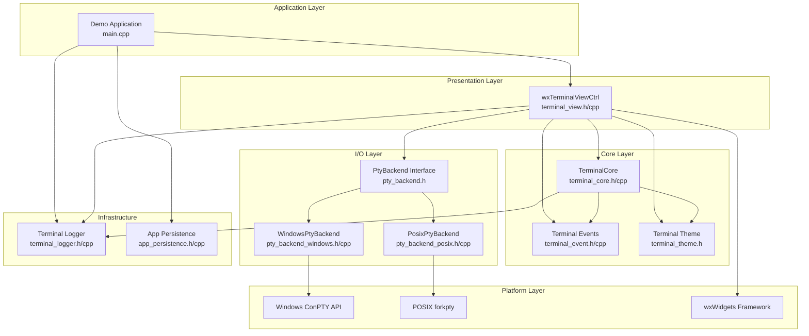
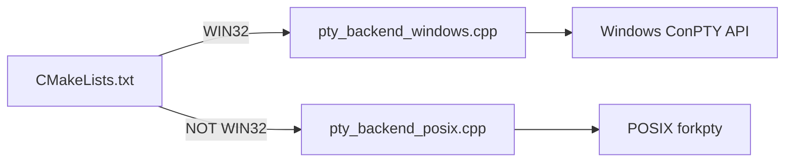
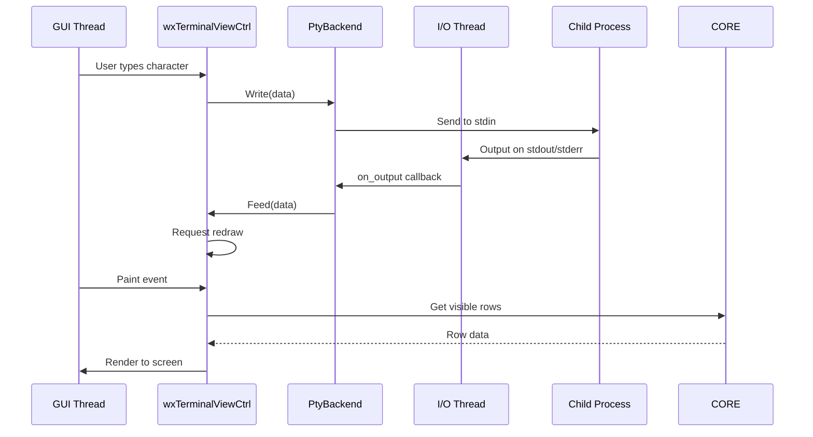
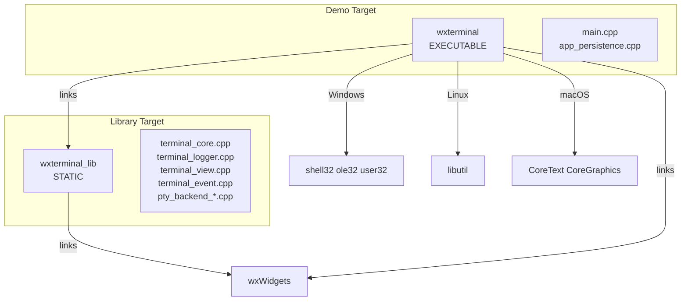

# System Architecture

## Overview

wxTerminalEmulator is a cross-platform terminal emulation library built on wxWidgets. It follows a layered architecture with clear separation between terminal emulation logic, platform-specific I/O, and GUI rendering.

## High-Level Architecture

## Design Patterns

### 1. Model-View Pattern
- **Model**: `TerminalCore` manages the terminal state, buffer, and escape sequence parsing
- **View**: `wxTerminalViewCtrl` handles rendering and user input
- The model is independent of wxWidgets; the view bridges to the GUI framework

### 2. Strategy Pattern (Platform Abstraction)
- `PtyBackend` defines the interface for platform-specific pseudo-terminal implementations
- `WindowsPtyBackend` and `PosixPtyBackend` provide concrete implementations
- Selection is determined at compile time via CMake platform checks

### 3. Observer Pattern
- Custom wxWidgets events (`wxTerminalEvent`) notify observers of terminal state changes
- Callbacks (`SetTitleCallback`, `SetResponseCallback`, `SetBellCallback`) allow loose coupling

### 4. Factory Pattern
- `PtyBackend::Create()` factory method instantiates the appropriate backend for the platform
- `wxTerminalTheme::MakeDarkTheme()` and `MakeLightTheme()` create pre-configured themes

## Platform Abstraction Strategy

The codebase uses conditional compilation and separate implementation files for platform-specific code:

### Platform-Specific Considerations

| Platform | I/O Backend | Special Handling |
|----------|-------------|------------------|
| Windows (MinGW) | ConPTY | Requires Windows 10 Build 17763+, uses `PeekNamedPipe` for non-blocking reads |
| macOS | forkpty | Links CoreText and CoreGraphics frameworks |
| Linux | forkpty | Links libutil for forkpty support |

## Threading Model

The PTY backends use threaded I/O to prevent blocking the GUI thread:

## Build Architecture

## Key Architectural Decisions

1. **Static Library**: The core is built as a static library for easy integration into wxWidgets applications
2. **C++20 Standard**: Uses modern C++ features (std::optional, structured bindings, concepts where applicable)
3. **wxWidgets Integration**: Deep integration with wxWidgets event system and rendering APIs
4. **UTF-8 Throughout**: All text processing uses UTF-8 encoding
5. **Cell-Based Buffer**: Terminal content is stored as a grid of cells with individual attributes
