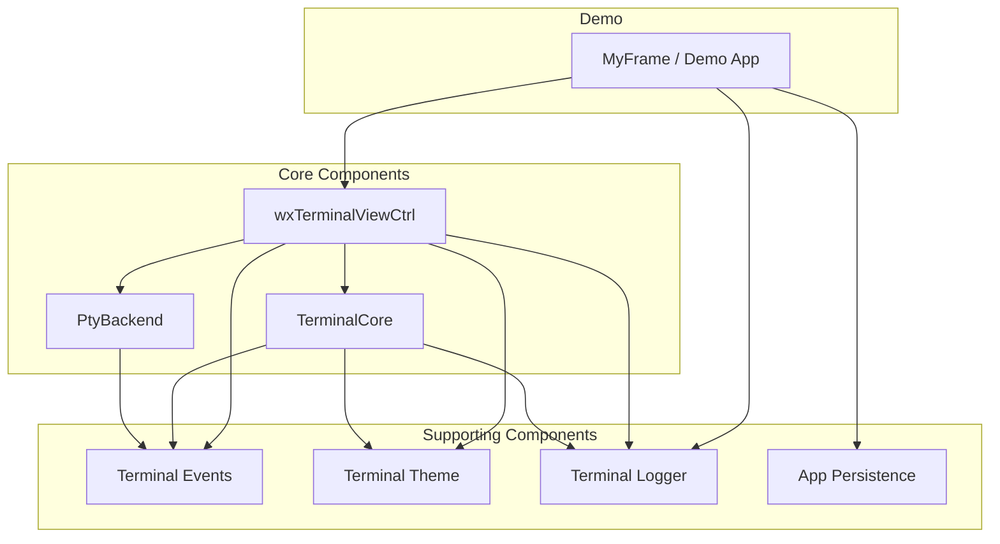

# Major Components

## Component Overview



---

## TerminalCore (`terminal_core.h/cpp`)

**Responsibility**: Terminal emulation engine - manages the terminal buffer, parses ANSI/VT100 escape sequences, and maintains terminal state.

### Key Capabilities
- Terminal buffer management (deque of cell rows with scrollback)
- ANSI/VT100 escape sequence parsing
- Cursor positioning and text attributes
- Scrollback and viewport management
- Alternate screen buffer support
- OSC (Operating System Command) sequence handling
- Title change and terminal response callbacks

### Public API Highlights
```cpp
// Construction and sizing
TerminalCore(std::size_t rows = 24, std::size_t cols = 80, std::size_t maxLines = 1000);
void Resize(std::size_t rows, std::size_t cols);
void SetViewportSize(std::size_t rows, std::size_t cols);

// Data input
void PutData(const std::string &data);
void AppendLine(const std::string &line);

// State management
void Reset();
void ClearScreen();
void MoveCursor(std::size_t row, std::size_t col);

// Callbacks
void SetResponseCallback(std::function<void(const std::string &)> callback);
void SetTitleCallback(std::function<void(const std::string &)> callback);
void SetBellCallback(std::function<void()> callback);

// Query
std::size_t Rows() const;
std::size_t Cols() const;
wxPoint Cursor() const;
std::size_t TotalLines() const;
const std::vector<Cell> &BufferRow(std::size_t absRow) const;
std::vector<const std::vector<Cell> *> GetViewArea() const;
wxString Flatten() const;

// Selection
void SetClickedRange(const wxRect &absRect);
bool ClearClickedRange();
wxString GetClickedText() const;
```

### Internal State
- `m_buffer`: Lines container (deque of rows with wrap flags)
- `m_viewStart`: Where the user is currently looking (scroll position)
- `m_shellStart`: Where the shell's viewport begins
- `m_cursor`: Current cursor position
- `m_scrollTop/m_scrollBottom`: Scroll region boundaries
- `m_altScreenActive`: Whether alternate screen buffer is active
- `m_attr`: Current SGR attributes

---

## wxTerminalViewCtrl (`terminal_view.h/cpp`)

**Responsibility**: wxWidgets panel that provides the visual terminal interface. Handles rendering, user input, selection, and clipboard operations.

### Key Capabilities
- Renders terminal content using wxDC/wxGCDC
- Handles keyboard and mouse input
- Manages text selection and clipboard operations
- Implements scrolling with mouse wheel and scrollbar
- Font caching for performance
- Auto-updates display with timer-based refresh
- Supports safe drawing mode, buffer navigation, and line centering
- Clickable text/links with Ctrl+click detection
- Double-click word selection with configurable delimiters

### Public API Highlights
```cpp
// Construction
wxTerminalViewCtrl(wxWindow *parent, const wxString &shellCommand,
                   const std::optional<EnvironmentList> &environment);

// Input
void SendInput(const std::string &text);
void SendCommand(const wxString &command);

// Special key helpers
void SendEnter(), SendTab(), SendEscape(), SendBackspace();
void SendArrowUp(), SendArrowDown(), SendArrowLeft(), SendArrowRight();
void SendHome(), SendEnd(), SendDelete(), SendInsert();
void SendPageUp(), SendPageDown();
void SendCtrlC(), SendCtrlL(), SendCtrlU(), SendCtrlK(), SendCtrlW();
void SendCtrlZ(), SendCtrlR(), SendCtrlD(), SendCtrlA(), SendCtrlE();
void SendAltB(), SendAltF();

// Clipboard
void Copy();
void Paste();

// Configuration
void SetTheme(const wxTerminalTheme &theme);
const wxTerminalTheme &GetTheme() const;
void EnableSafeDrawing(bool b);
bool IsSafeDrawing() const;
void SetBufferSize(std::size_t maxLines);
std::size_t GetBufferSize() const;
void SetSelectionDelimChars(const wxString &delims);

// Navigation
void ScrollToLastLine();
void CenterLine(std::size_t line);
std::size_t GetLineCount() const;
wxString GetLine(std::size_t line) const;
wxString GetViewLine(std::size_t line) const;

// Selection
void SetUserSelection(std::size_t row, std::size_t col, std::size_t count);
void ClearUserSelection();
void ClearMouseSelection();
bool HasActiveSelection() const;
wxString GetRange(std::size_t row, std::size_t col, std::size_t count);

// Focus
bool AcceptsFocus() const override { return true; }
bool AcceptsFocusFromKeyboard() const override { return true; }
```

### Rendering Pipeline
The view supports multiple rendering strategies:
- **Row grouping**: Groups adjacent cells with identical attributes for efficient drawing
- **No grouping**: Cell-by-cell rendering for maximum compatibility
- **POSIX optimized**: Platform-specific optimizations for Unix-like systems

---

## PtyBackend (`pty_backend.h`)

**Responsibility**: Abstract interface for platform-specific pseudo-terminal implementations.

### Interface Definition
```cpp
class PtyBackend {
public:
    using OutputCallback = std::function<void(const std::string &)>;
    using EnvironmentList = std::vector<std::string>;

    virtual ~PtyBackend() = default;
    virtual bool Start(const std::string &command,
                       const std::optional<EnvironmentList> &environment,
                       OutputCallback on_output) = 0;
    virtual void Write(const std::string &data) = 0;
    virtual void Resize(int cols, int rows) = 0;
    virtual void SendBreak() = 0;  // Ctrl-C
    virtual void Stop() = 0;
    virtual wxArrayString GetChildren() const = 0;
    static std::unique_ptr<PtyBackend> Create(wxEvtHandler *handler);
};
```

### Platform Implementations

#### WindowsPtyBackend (`pty_backend_windows.h/cpp`)
- Uses Windows ConPTY API (Windows 10 Build 17763+)
- Creates pseudo-console with `CreatePseudoConsole`
- Uses `PeekNamedPipe` for non-blocking reads
- Supports process tree enumeration via `GetChildren()`

#### PosixPtyBackend (`pty_backend_posix.h/cpp`)
- Uses `forkpty` for Linux and macOS
- Bidirectional I/O with child process
- Terminal resizing via `TIOCSWINSZ`

---

## Terminal Events (`terminal_event.h/cpp`)

**Responsibility**: Custom wxWidgets events for terminal-specific notifications.

### Event Types
| Event | Description | Payload |
|-------|-------------|---------|
| `wxEVT_TERMINAL_TITLE_CHANGED` | Terminal title changed via OSC | `GetTitle()` |
| `wxEVT_TERMINAL_TERMINATED` | Shell/process exited | None |
| `wxEVT_TERMINAL_TEXT_LINK` | User Ctrl+clicked text | `GetClickedText()` |
| `wxEVT_TERMINAL_BELL` | Terminal bell (BEL character) | None |

### Usage Example
```cpp
terminal->Bind(wxEVT_TERMINAL_TITLE_CHANGED, [](wxTerminalEvent& evt) {
    wxString title = evt.GetTitle();
    // Update window title
});
```

---

## Terminal Theme (`terminal_theme.h`)

**Responsibility**: Color scheme management for the terminal.

### Structure
- Default foreground/background colors
- Standard 16 ANSI colors (normal + bright variants)
- Selection and highlight colors with alpha transparency
- Cursor color and link color
- Font configuration

### Pre-defined Themes
- `MakeDarkTheme()`: Dark color scheme with modern colors
- `MakeLightTheme()`: Light color scheme with dark text

### Color Helpers
- `GetAnsiColor(index, bright)`: Get ANSI color by index (0-7)
- `Get256Color(index)`: Get 256-color palette entry
- `ToU32(color)`: Convert wxColour to packed RGB

---

## Terminal Logger (`terminal_logger.h/cpp`)

**Responsibility**: Debug logging and diagnostics support.

### Features
- Configurable log levels: Trace, Debug, Info, Warn, Error
- Optional file output via `SetLogFile()`
- Stream-based logging API with `operator<<`
- Function timing with `LogFunction` helper
- Counter tracking for performance analysis

### Macros
```cpp
TLOG(level)          // Log at specific level
TLOG_DEBUG()         // Convenience macros
TLOG_WARN()
TLOG_ERROR()
TLOG_TRACE()
TLOG_INFO()
TLOG_IF(level)       // Conditional logging
```

---

## App Persistence (`app_persistence.h/cpp`)

**Responsibility**: Simple settings persistence for the demo application.

### API
```cpp
static wxString GetConfigPath();
static bool Load(wxString &themeName, wxFont &font);
static bool Load(bool &safeDrawingEnabled);
static bool Save(const wxString &themeName, const wxFont &font,
                 bool safeDrawingEnabled);
```

---

## Demo Application (`main.cpp`)

**Responsibility**: Example application demonstrating library usage.

### Features
- Notebook with multiple terminal tabs
- Theme switching (dark/light)
- Font selection dialog
- Safe drawing mode toggle
- Line centering and selection tools
- Environment variable passing support
- Command-line argument parsing (`--shell`, `--env`)
