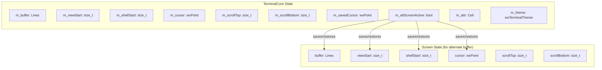

# Data Structures and Models

## Core Data Structures

### Cell

The `Cell` struct represents a single character cell in the terminal buffer.

```cpp
struct Cell {
    char32_t ch{U' '};                          // Unicode character
    std::optional<CellColours> colours{std::nullopt};  // Foreground/background colors
    CellFlags flags{CellFlags::kNone};          // Text attributes
};
```

#### CellFlags
```cpp
enum class CellFlags {
    kNone = 0,
    kBold = (1 << 0),        // Bold text
    kUnderlined = (1 << 1),  // Underlined text
    kReverse = (1 << 2),     // Reverse video (swap fg/bg)
    kClicked = (1 << 3),     // Clicked/highlighted state
};
```

#### Cell Methods
```cpp
void SetBold(bool b);
bool IsBold() const;
void SetUnderlined(bool b);
bool IsUnderlined() const;
void SetReverse(bool b);
bool IsReverse() const;
void SetClicked(bool b);
bool IsClicked() const;
bool IsEmpty() const;        // True if space with no colors
void SetFgColour(ColourSpec c);
void SetBgColour(ColourSpec c);
static Cell New(char32_t c = U' ');
```

---

### ColourSpec

Represents a color specification with multiple possible sources.

```cpp
struct ColourSpec {
    enum class Kind { 
        Default,    // Use theme default
        Ansi,       // ANSI color index (0-7, bright flag)
        Palette256, // 256-color palette index (0-255)
        TrueColor   // 24-bit RGB color
    } kind{Kind::Default};
    
    ColourIndex ansi{};      // For Kind::Ansi
    int paletteIndex{-1};    // For Kind::Palette256
    std::uint32_t rgb{0};    // For Kind::TrueColor (0xRRGGBB)
};

struct ColourIndex {
    int index{-1};           // ANSI color index (0-7)
    bool bright{false};      // Bright variant flag
};
```

---

### CellColours

Container for foreground and background color specifications.

```cpp
struct CellColours {
    std::optional<ColourSpec> bg{std::nullopt};
    std::optional<ColourSpec> fg{std::nullopt};
};
```

---

### Lines Container

Synchronized container for terminal rows and their wrap flags.

```cpp
struct Lines {
    using Row = std::vector<Cell>;
    
    std::size_t size() const;
    void clear();
    void push_back(Row row, bool wrapped = false);
    void pop_front();
    
    Row &operator[](std::size_t i);
    const Row &operator[](std::size_t i) const;
    
    bool IsWrapped(std::size_t i) const;   // Row continues on next line
    void SetWrapped(std::size_t i, bool v);
    
private:
    std::deque<Row> m_rows;
    std::deque<bool> m_wrapped;
};
```

The `Lines` container uses `std::deque` for efficient push/pop at both ends, supporting scrollback buffer management.

---

## Terminal State

### TerminalCore Internal State



#### Key State Variables

| Variable | Description |
|----------|-------------|
| `m_rows`, `m_cols` | Terminal dimensions |
| `m_maxLines` | Maximum scrollback buffer size |
| `m_buffer` | Main terminal buffer (Lines container) |
| `m_viewStart` | First visible row (user scroll position) |
| `m_shellStart` | Shell viewport origin (for cursor/I/O) |
| `m_cursor` | Current cursor position (col, row) |
| `m_scrollTop`, `m_scrollBottom` | Scroll region boundaries |
| `m_savedCursor` | Saved cursor position (ESC[s / ESC[u) |
| `m_altScreenActive` | Alternate screen buffer active flag |
| `m_attr` | Current SGR attributes |
| `m_lastChar` | Last printed character (for ESC[b repeat) |
| `m_clickedRect` | Current clicked/selected range |

---

## wxTerminalTheme

Complete color and font configuration for the terminal.

```cpp
struct wxTerminalTheme {
    // Default colors
    wxColour fg;           // Foreground
    wxColour bg;           // Background
    wxFont font;           // Base font
    
    // ANSI normal colors (0-7)
    wxColour black, red, green, yellow;
    wxColour blue, magenta, cyan, white;
    
    // ANSI bright colors (8-15)
    wxColour brightBlack, brightRed, brightGreen, brightYellow;
    wxColour brightBlue, brightMagenta, brightCyan, brightWhite;
    
    // Selection colors
    wxColour selectionBg, selectionFg;
    wxColour highlightBg, highlightFg;
    
    // Cursor and link
    wxColour cursorColour;
    wxColour linkColour;
    
    bool isMonospaced;
};
```

### Color Resolution

```mermaid
graph TD
    A[ColourSpec] -->|Kind::Default| B[Use theme default]
    A -->|Kind::Ansi| C[theme.GetAnsiColor(index, bright)]
    A -->|Kind::Palette256| D[theme.Get256Color(index)]
    A -->|Kind::TrueColor| E[Direct RGB value]
    
    C --> F[wxColour]
    D --> F
    E --> F
```

---

## Selection State

### LinearSelection (Mouse Selection)

```cpp
struct LinearSelection {
    wxPoint anchor;           // Cell where mouse-down occurred
    wxPoint current;          // Cell where mouse currently is
    std::size_t viewStart{0}; // viewStart when selection was created
    bool active{false};
    
    void Clear();
    void GetNormalized(wxPoint &s, wxPoint &e) const;
    void GetAbsNormalized(wxPoint &s, wxPoint &e) const;
    bool Contains(int col, int row) const;
    bool HasSelection() const;
    void AdjustForScroll(int delta);
};
```

### ApiSelection (Programmatic Selection)

```cpp
struct ApiSelection {
    std::size_t row{0}, col{0}, endCol{0};
    bool active{false};
    void Clear();
};
```

---

## Rendering Data Structures

### CellAttributes

Aggregated attributes for rendering decisions.

```cpp
struct CellAttributes {
    wxColour fgColor;
    wxColour bgColor;
    bool bold;
    bool underline;
    bool isMouseSelected;
    bool isApiSelected;
    bool isClicked{false};
    
    bool operator==(const CellAttributes &other) const;
    bool operator!=(const CellAttributes &other) const;
};
```

### CellInfo

Extended cell information for rendering pipeline.

```cpp
struct CellInfo {
    int colIdx{wxNOT_FOUND};
    wxChar ch{' '};
    CellAttributes attrs;
    
    bool IsUnicode() const;
    bool HasSameAttributes(const CellInfo &other) const;
    bool IsAdjacent(const CellInfo &other) const;
    bool IsLeftTo(const CellInfo &other) const;
    bool IsRightTo(const CellInfo &other) const;
    bool IsSelected() const;
    bool IsOk() const;
};
```

---

## Data Flow

### Input Data Flow
```
User Input → wxTerminalViewCtrl → PtyBackend.Write() → Child Process
```

### Output Data Flow
```
Child Process → PtyBackend I/O Thread → on_output callback → 
wxTerminalViewCtrl::Feed() → TerminalCore::PutData() → Buffer Update → Render
```

### Buffer Organization
```
Scrollback Region (m_viewStart to m_shellStart-1)
    ↑ User can scroll up to view history
    
Active Shell Region (m_shellStart to end)
    ↑ Current terminal session
    ↑ Cursor positioned relative to m_shellStart
```
