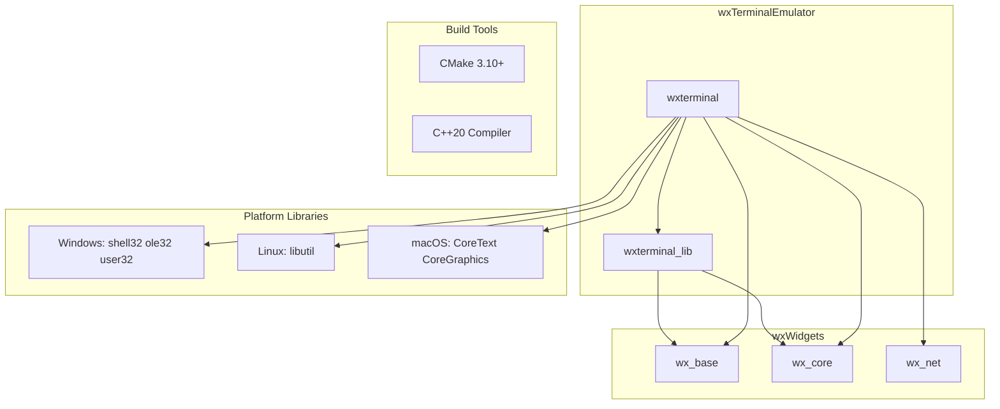

# External Dependencies and Their Usage

## Core Dependencies

### wxWidgets

**Version**: 3.2.x (tested with v3.2.8.1)  
**Purpose**: Cross-platform GUI framework  
**Components Used**:

| Component | Usage |
|-----------|-------|
| `wx/base` | Core classes, string handling, file operations |
| `wx/core` | GUI components (wxPanel, wxFrame, wxDC, wxFont, wxColour) |
| `wx/net` | Network utilities (if needed) |

**Key wxWidgets Classes**:
- `wxPanel` - Base class for wxTerminalViewCtrl
- `wxDC` / `wxGCDC` - Drawing contexts for rendering
- `wxFont` / `wxFontDialog` - Font management
- `wxColour` - Color representation
- `wxTimer` - Refresh timer
- `wxClipboard` - Copy/paste operations
- `wxNotebook` - Tabbed interface in demo
- `wxEvent` / `wxCommandEvent` - Event system
- `wxFrame` / `wxMenu` - Demo application UI

**CMake Integration**:
```cmake
find_package(wxWidgets COMPONENTS base core net REQUIRED)
include(${wxWidgets_USE_FILE})
target_link_libraries(wxterminal_lib PUBLIC ${wxWidgets_LIBRARIES})
```

**Windows MinGW Special Handling**:
- Requires `WXWIN` path to wxWidgets installation
- Uses `wx-config` for configuration
- Links with `shell32 ole32 user32`

---

## Platform-Specific Dependencies

### Windows

| Library | Purpose |
|---------|---------|
| ConPTY API | Pseudo-console support (Windows 10 Build 17763+) |
| `shell32` | Windows shell API |
| `ole32` | OLE/COM support |
| `user32` | User interface API |

**APIs Used**:
- `CreatePseudoConsole` / `ClosePseudoConsole`
- `ResizePseudoConsole` / `ResizePseudoConsoleDirect`
- `PeekNamedPipe` - Non-blocking pipe reads
- `CreateProcess` with `EXTENDED_STARTUPINFO_PRESENT`

### Linux

| Library | Purpose |
|---------|---------|
| `libutil` | `forkpty` support |
| `libgtk-3` | GTK backend for wxWidgets |

**Headers Used**:
- `pty.h` - Pseudo-terminal functions
- `termios.h` - Terminal I/O settings
- `sys/ioctl.h` - `TIOCSWINSZ` for resize

### macOS

| Framework | Purpose |
|-----------|---------|
| `CoreText` | Text rendering support |
| `CoreGraphics` | Graphics rendering support |

---

## Build Dependencies

### CMake

**Minimum Version**: 3.10  
**Features Used**:
- `project()` with C++20 standard
- `find_package()` for wxWidgets
- `option()` for build configuration
- `execute_process()` for wx-config on Windows
- Generator expressions for platform-specific linking

### Compiler Requirements

| Feature | Requirement |
|---------|-------------|
| C++ Standard | C++20 |
| Windows | Clang (MinGW) |
| Linux | GCC or Clang |
| macOS | Clang |

**C++20 Features Used**:
- `std::optional` - Optional values
- `std::underlying_type_t` - Enum type introspection
- Structured bindings (implied by codebase style)
- `constexpr` functions

---

## CI/CD Dependencies

### GitHub Actions

| Workflow | Runner | Dependencies |
|----------|--------|--------------|
| `macos.yml` | macos-latest | wxWidgets build from source |
| `msys2.yml` | windows-latest | MSYS2 Clang64, wxWidgets build |
| `ubuntu.yml` | ubuntu-latest | GTK3, wxWidgets build from source |

### CI Build Steps

1. **Checkout wxWidgets** at version v3.2.8.1 with submodules
2. **Build and install wxWidgets** with platform-specific options
3. **Checkout wxTerminalEmulator**
4. **Build** with CMake

---

## Optional Dependencies

### Demo Application Features

| Feature | wxWidgets Component |
|---------|---------------------|
| Font dialog | `wxFontDialog` |
| Message boxes | `wxMessageBox` |
| Text input dialogs | `wxGetTextFromUser` |
| Command-line parsing | `wxCmdLineParser` |
| Display information | `wxDisplay` |

---

## Dependency Graph



---

## Version Constraints

| Dependency | Minimum Version | Notes |
|------------|-----------------|-------|
| CMake | 3.10 | Required for modern CMake features |
| wxWidgets | 3.2.x | Tested with v3.2.8.1 |
| Windows | 10 Build 17763 | Required for ConPTY API |
| C++ Standard | C++20 | Required for std::optional, constexpr |
