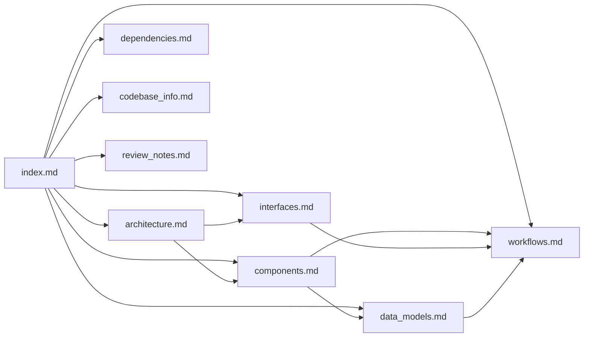

# wxTerminalEmulator Knowledge Base Index

## For AI Assistants: How to Use This Documentation

This directory contains comprehensive documentation about the wxTerminalEmulator project. As an AI assistant, use this index to quickly locate relevant information.

### Quick Navigation

| If you need to... | Consult this file |
|---------------------|-------------------|
| Understand the overall system architecture | [architecture.md](architecture.md) |
| Learn about specific components and their responsibilities | [components.md](components.md) |
| Understand APIs, interfaces, and integration points | [interfaces.md](interfaces.md) |
| Understand data structures and models | [data_models.md](data_models.md) |
| Understand key processes and workflows | [workflows.md](workflows.md) |
| Understand external dependencies | [dependencies.md](dependencies.md) |
| Get basic codebase information | [codebase_info.md](codebase_info.md) |
| See review notes and known gaps | [review_notes.md](review_notes.md) |

### File Summaries

#### [architecture.md](architecture.md)
**Purpose**: System architecture and design patterns  
**Contains**: High-level architecture diagram, component interactions, design patterns, platform abstraction strategy  
**Use when**: Answering questions about how the system is organized, design decisions, or platform-specific implementations

#### [components.md](components.md)
**Purpose**: Major components and their responsibilities  
**Contains**: Detailed descriptions of each major component (TerminalCore, wxTerminalViewCtrl, PTY backends, events, theme, logger), their public APIs, and responsibilities  
**Use when**: Answering questions about what a specific component does, its API, or how to use it

#### [interfaces.md](interfaces.md)
**Purpose**: APIs, interfaces, and integration points  
**Contains**: Public API documentation, event system, integration patterns, backend interface contract  
**Use when**: Answering questions about how to integrate with the library, event handling, or backend implementation

#### [data_models.md](data_models.md)
**Purpose**: Data structures and models  
**Contains**: Cell structure, Lines container, color specifications, theme structure, selection state  
**Use when**: Answering questions about data representation, terminal buffer structure, or color handling

#### [workflows.md](workflows.md)
**Purpose**: Key processes and workflows  
**Contains**: Data flow diagrams, input handling workflow, rendering pipeline, escape sequence parsing, resize handling  
**Use when**: Answering questions about how data flows through the system, rendering, or terminal operations

#### [dependencies.md](dependencies.md)
**Purpose**: External dependencies and their usage  
**Contains**: wxWidgets components, platform-specific libraries, build tools, CI dependencies  
**Use when**: Answering questions about build requirements, external libraries, or platform setup

#### [codebase_info.md](codebase_info.md)
**Purpose**: Basic codebase metadata  
**Contains**: File structure, build targets, supported platforms, key technologies  
**Use when**: Need quick reference for project structure or build information

#### [review_notes.md](review_notes.md)
**Purpose**: Documentation review findings  
**Contains**: Consistency check results, completeness gaps, recommendations for improvement  
**Use when**: Identifying areas that need more documentation or known limitations

## Cross-Reference Map

## Example Queries

**Q: How do I add a new escape sequence handler?**  
→ Check [components.md](components.md) for TerminalCore, then [workflows.md](workflows.md) for escape sequence parsing flow

**Q: What events does the terminal emit?**  
→ Check [interfaces.md](interfaces.md) for the event system section

**Q: How does the terminal buffer work?**  
→ Check [data_models.md](data_models.md) for Lines and Cell structures, then [components.md](components.md) for TerminalCore

**Q: How do I implement a custom PTY backend?**  
→ Check [interfaces.md](interfaces.md) for PtyBackend interface, then [components.md](components.md) for existing implementations

**Q: What build options are available?**  
→ Check [codebase_info.md](codebase_info.md) and [dependencies.md](dependencies.md)

**Q: How does rendering work?**  
→ Check [workflows.md](workflows.md) for the rendering pipeline, then [components.md](components.md) for wxTerminalViewCtrl
