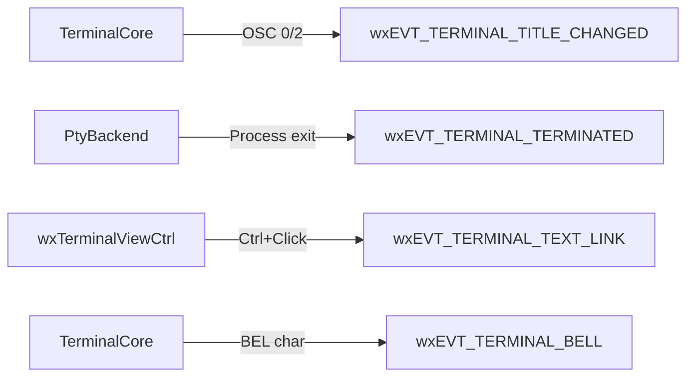

# APIs, Interfaces, and Integration Points

## Public API Surface

### 1. TerminalCore API

The `TerminalCore` class is the primary interface for terminal emulation logic. It is framework-agnostic and can be used independently of wxWidgets.

#### Construction and Configuration
```cpp
TerminalCore(std::size_t rows = 24, std::size_t cols = 80, std::size_t maxLines = 1000);
void Resize(std::size_t rows, std::size_t cols);
void SetViewportSize(std::size_t rows, std::size_t cols);
void SetMaxLines(std::size_t maxLines);
void SetTheme(const wxTerminalTheme &theme);
```

#### Data Input
```cpp
void PutData(const std::string &data);     // Process raw terminal data
void AppendLine(const std::string &line);  // Append a plain text line
```

#### State Control
```cpp
void Reset();                              // Reset terminal to initial state
void ClearScreen();                        // Clear visible screen
void MoveCursor(std::size_t row, std::size_t col);
```

#### Callbacks
```cpp
void SetResponseCallback(std::function<void(const std::string &)> callback);
void SetTitleCallback(std::function<void(const std::string &)> callback);
void SetBellCallback(std::function<void()> callback);
```

#### Queries
```cpp
std::size_t Rows() const;
std::size_t Cols() const;
std::size_t MaxLines() const;
wxPoint Cursor() const;                    // Cursor position relative to viewport
std::size_t ViewStart() const;             // First visible row in buffer
std::size_t ShellStart() const;            // Shell viewport origin
std::size_t TotalLines() const;            // Total lines in buffer
const std::vector<Cell> &BufferRow(std::size_t absRow) const;
std::vector<const std::vector<Cell> *> GetViewArea() const;
wxString Flatten() const;                  // Flatten buffer to string
```

#### Selection
```cpp
void SetClickedRange(const wxRect &absRect);
bool ClearClickedRange();
wxString GetClickedText() const;
wxString GetTextRange(std::size_t row, std::size_t col, std::size_t count) const;
```

---

### 2. wxTerminalViewCtrl API

The `wxTerminalViewCtrl` is a wxWidgets panel that integrates `TerminalCore` with the GUI. It is the primary component for embedding a terminal in a wxWidgets application.

#### Construction
```cpp
wxTerminalViewCtrl(wxWindow *parent, const wxString &shellCommand,
                   const std::optional<EnvironmentList> &environment);
```
- `shellCommand`: Command to execute (empty string for default shell)
- `environment`: Optional environment variables to pass to the child process

#### Input Methods
```cpp
void SendInput(const std::string &text);
void SendCommand(const wxString &command);  // Sends command + Enter
```

#### Special Key Helpers
```cpp
// Navigation
void SendEnter(), SendTab(), SendEscape(), SendBackspace();
void SendArrowUp(), SendArrowDown(), SendArrowLeft(), SendArrowRight();
void SendHome(), SendEnd(), SendDelete(), SendInsert();
void SendPageUp(), SendPageDown();

// Control combinations
void SendCtrlC(), SendCtrlL(), SendCtrlU(), SendCtrlK(), SendCtrlW();
void SendCtrlZ(), SendCtrlR(), SendCtrlD(), SendCtrlA(), SendCtrlE();

// Alt combinations
void SendAltB(), SendAltF();
```

#### Clipboard
```cpp
void Copy();
void Paste();
```

#### Configuration
```cpp
void SetTheme(const wxTerminalTheme &theme);
const wxTerminalTheme &GetTheme() const;
void EnableSafeDrawing(bool b);            // Compatibility rendering mode
bool IsSafeDrawing() const;
void SetBufferSize(std::size_t maxLines);
std::size_t GetBufferSize() const;
void SetSelectionDelimChars(const wxString &delims);
```

#### Navigation
```cpp
void ScrollToLastLine();
void CenterLine(std::size_t line);
std::size_t GetLineCount() const;
wxString GetLine(std::size_t line) const;       // Absolute line
wxString GetViewLine(std::size_t line) const;   // Viewport-relative line
```

#### Selection
```cpp
void SetUserSelection(std::size_t row, std::size_t col, std::size_t count);
void ClearUserSelection();
void ClearMouseSelection();
bool HasActiveSelection() const;
wxString GetRange(std::size_t row, std::size_t col, std::size_t count);
```

#### Coordinate Conversion
```cpp
std::optional<wxPoint> PointToCell(const wxPoint &pt) const;
```
Converts mouse position in client coordinates to terminal cell coordinates.

---

### 3. PtyBackend Interface

Abstract interface for platform-specific pseudo-terminal implementations.

```cpp
class PtyBackend {
public:
    using OutputCallback = std::function<void(const std::string &)>;
    using EnvironmentList = std::vector<std::string>;

    virtual ~PtyBackend() = default;
    
    // Start the PTY with a command and optional environment
    virtual bool Start(const std::string &command,
                       const std::optional<EnvironmentList> &environment,
                       OutputCallback on_output) = 0;
    
    // Write data to the PTY stdin
    virtual void Write(const std::string &data) = 0;
    
    // Resize the terminal
    virtual void Resize(int cols, int rows) = 0;
    
    // Send break signal (Ctrl-C)
    virtual void SendBreak() = 0;
    
    // Stop the PTY and clean up
    virtual void Stop() = 0;
    
    // Get child process names (newest first)
    virtual wxArrayString GetChildren() const = 0;
    
    // Factory method
    static std::unique_ptr<PtyBackend> Create(wxEvtHandler *handler);
};
```

---

## Event System

### Custom wxWidgets Events



### Event Details

#### wxEVT_TERMINAL_TITLE_CHANGED
- **Fired when**: Terminal sends OSC 0 or OSC 2 sequence
- **Payload**: `GetTitle()` returns the new title string
- **Typical use**: Update window title bar

#### wxEVT_TERMINAL_TERMINATED
- **Fired when**: Child process exits
- **Payload**: None
- **Typical use**: Clean up or restart terminal

#### wxEVT_TERMINAL_TEXT_LINK
- **Fired when**: User Ctrl+clicks on text
- **Payload**: `GetClickedText()` returns the clicked text token
- **Typical use**: Open URLs, files, or handle custom link types

#### wxEVT_TERMINAL_BELL
- **Fired when**: BEL character (0x07) is received
- **Payload**: None
- **Typical use**: Play system beep or visual bell

### Event Binding Example
```cpp
wxTerminalViewCtrl* terminal = new wxTerminalViewCtrl(parent, "", std::nullopt);

terminal->Bind(wxEVT_TERMINAL_TITLE_CHANGED, [](wxTerminalEvent& evt) {
    frame->SetTitle(evt.GetTitle());
});

terminal->Bind(wxEVT_TERMINAL_TERMINATED, [](wxTerminalEvent& evt) {
    // Handle process termination
});

terminal->Bind(wxEVT_TERMINAL_TEXT_LINK, [](wxTerminalEvent& evt) {
    wxString text = evt.GetClickedText();
    wxLaunchDefaultBrowser(text);
});
```

---

## Integration Patterns

### Basic Integration

```cpp
#include "terminal_view.h"

// In your wxWidgets window constructor:
wxTerminalViewCtrl* terminal = new wxTerminalViewCtrl(parent, "", std::nullopt);
terminal->SetTheme(wxTerminalTheme::MakeDarkTheme());

// Handle events
terminal->Bind(wxEVT_TERMINAL_TITLE_CHANGED, &MyFrame::OnTitleChanged, this);
```

### Custom Shell Command

```cpp
// Launch specific shell with environment variables
terminal::PtyBackend::EnvironmentList env = {"MY_VAR=value"};
wxTerminalViewCtrl* terminal = new wxTerminalViewCtrl(parent, 
    "/bin/bash", env);
```

### Programmatic Input

```cpp
// Send text and execute
terminal->SendCommand("ls -la");

// Send raw input
terminal->SendInput("hello world\r");

// Send control sequences
terminal->SendCtrlC();  // Interrupt
terminal->SendCtrlL();  // Clear screen
```

### Theme Customization

```cpp
wxTerminalTheme theme = wxTerminalTheme::MakeDarkTheme();
theme.font = wxFont(16, wxFONTFAMILY_TELETYPE, wxFONTSTYLE_NORMAL, wxFONTWEIGHT_NORMAL);
theme.fg = wxColour("#00FF00");  // Green text
theme.bg = wxColour("#000000");  // Black background
terminal->SetTheme(theme);
```

---

## Backend Implementation Guide

To implement a custom PTY backend:

1. Inherit from `PtyBackend`
2. Implement all pure virtual methods
3. Register in `PtyBackend::Create()` factory

```cpp
class CustomPtyBackend : public terminal::PtyBackend {
public:
    CustomPtyBackend(wxEvtHandler* handler) : PtyBackend(handler) {}
    
    bool Start(const std::string &command,
               const std::optional<EnvironmentList> &environment,
               OutputCallback on_output) override {
        // Implementation
    }
    
    void Write(const std::string &data) override {
        // Implementation
    }
    
    void Resize(int cols, int rows) override {
        // Implementation
    }
    
    void SendBreak() override {
        // Implementation
    }
    
    void Stop() override {
        // Implementation
    }
    
    wxArrayString GetChildren() const override {
        // Implementation
    }
};
```
