# Key Processes and Workflows

## Data Flow Overview

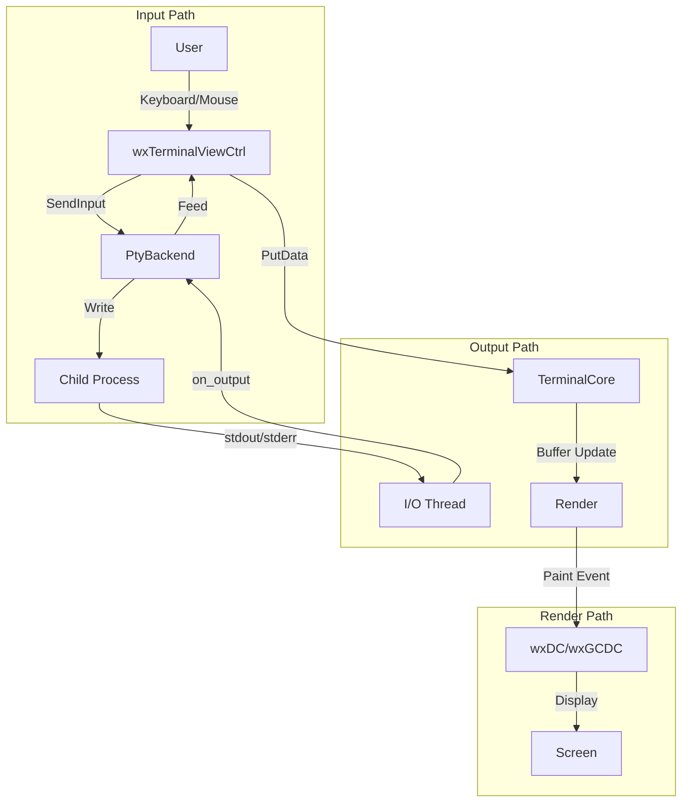

---

## 1. Terminal Initialization Workflow

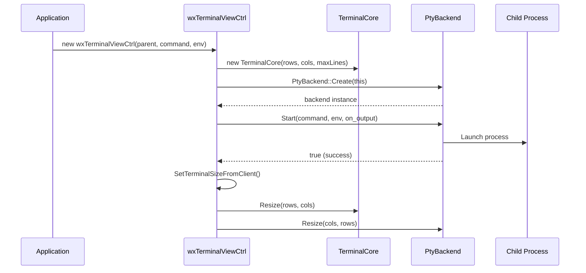

---

## 2. Input Handling Workflow

### Keyboard Input

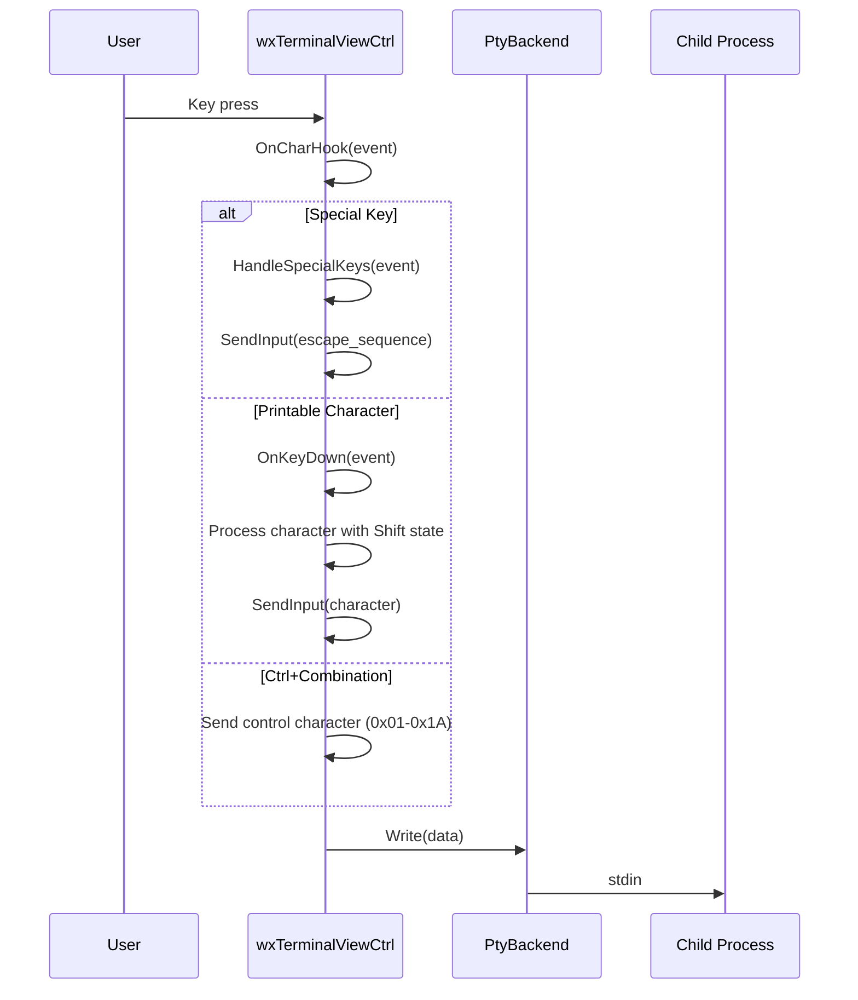

### Mouse Input

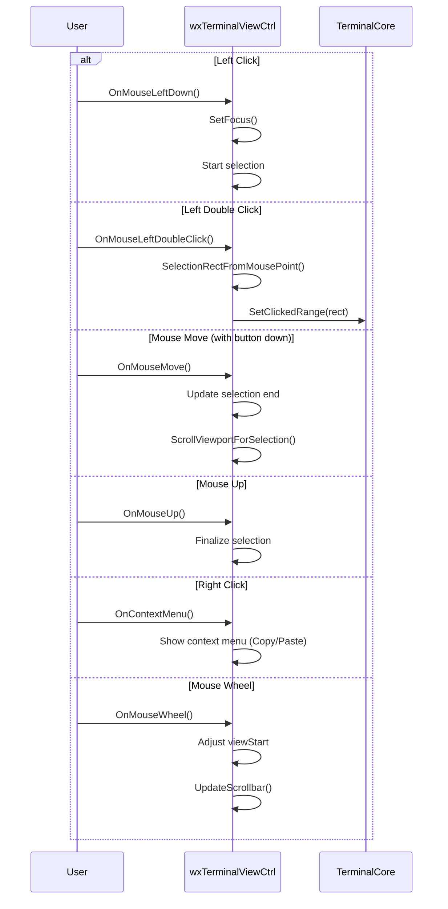

### Ctrl+Click (Link Detection)

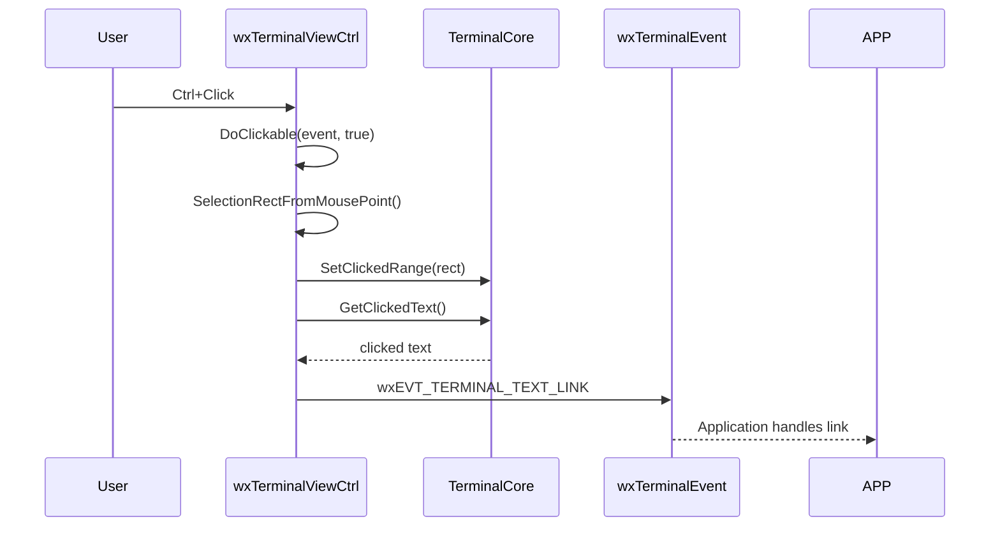

---

## 3. Escape Sequence Parsing Workflow

```mermaid
graph TD
    A[PutData] -->|character by character| B{In Escape?}
    B -->|No| C{Is ESC?}
    C -->|Yes| D[Set m_inEscape = true]
    C -->|No| E{Is Printable?}
    E -->|Yes| F[PutPrintable]
    E -->|No| G[Handle Control Char]
    
    B -->|Yes| H[Accumulate in m_escape]
    H --> I{Complete Sequence?}
    I -->|Yes| J[ParseEscape]
    I -->|No| K[Continue accumulating]
    
    J -->|CSI [ ... | L[Parse CSI params]
    J -->|OSC ] ... | M[Parse OSC string]
    J -->|Other| N[Handle single-char escape]
    
    L --> O[Execute CSI command]
    M --> P[Execute OSC command]
```

### Supported Escape Sequences

#### CSI Sequences (ESC[...)
| Sequence | Description |
|----------|-------------|
| `ESC[nA` | Cursor up |
| `ESC[nB` | Cursor down |
| `ESC[nC` | Cursor forward |
| `ESC[nD` | Cursor back |
| `ESC[nE` | Cursor next line |
| `ESC[nF` | Cursor previous line |
| `ESC[nG` | Cursor horizontal absolute |
| `ESC[row;colH` / `ESC[row;colf` | Cursor position |
| `ESC[nJ` | Erase display (0=after, 1=before, 2=all, 3=scrollback) |
| `ESC[nK` | Erase line (0=after, 1=before, 2=all) |
| `ESC[nS` | Scroll up |
| `ESC[nT` | Scroll down |
| `ESC[nX` | Erase character |
| `ESC[n@` | Insert character |
| `ESC[nP` | Delete character |
| `ESC[nL` | Insert line |
| `ESC[nM` | Delete line |
| `ESC[nm` | SGR (Select Graphic Rendition) |
| `ESC[?nh` / `ESC[?nl` | Set/reset mode |
| `ESC[s` | Save cursor |
| `ESC[u` | Restore cursor |

#### OSC Sequences (ESC]...)
| Sequence | Description |
|----------|-------------|
| `ESC]0;titleBEL` | Set icon and window title |
| `ESC]2;titleBEL` | Set window title |

#### SGR Parameters
| Parameter | Effect |
|-----------|--------|
| 0 | Reset |
| 1 | Bold |
| 4 | Underline |
| 7 | Reverse video |
| 30-37 | Foreground color (ANSI) |
| 40-47 | Background color (ANSI) |
| 90-97 | Bright foreground |
| 100-107 | Bright background |
| 38;5;n | Foreground 256-color |
| 48;5;n | Background 256-color |
| 38;2;r;g;b | Foreground true color |
| 48;2;r;g;b | Background true color |

---

## 4. Rendering Pipeline

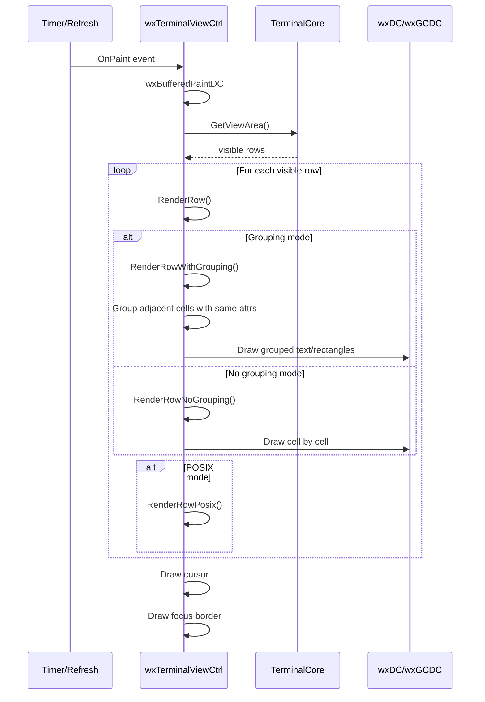

### Rendering Strategies

1. **Row Grouping** (`RenderRowWithGrouping`): Groups adjacent cells with identical attributes for efficient `DrawText` calls
2. **No Grouping** (`RenderRowNoGrouping`): Cell-by-cell rendering for maximum compatibility
3. **POSIX Optimized** (`RenderRowPosix`): Platform-specific optimizations

---

## 5. Terminal Resize Workflow

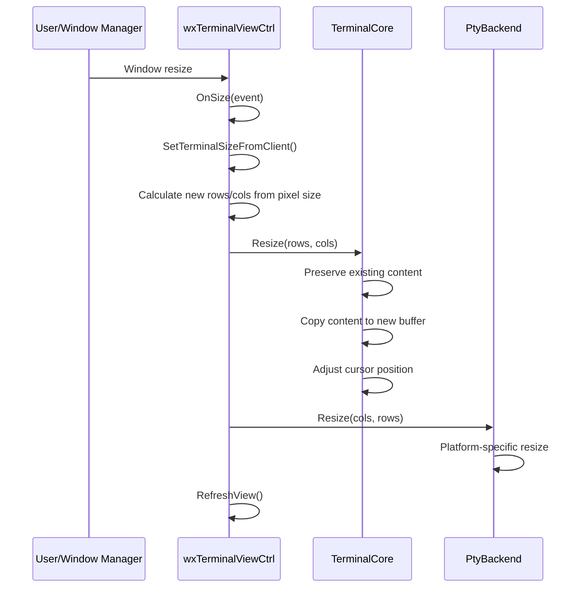

### Resize Behavior
- Preserves existing screen content when possible
- Copies as much content as fits in new dimensions
- Adjusts cursor to remain within new bounds
- Handles both growing and shrinking
- Notifies PTY backend of size change

---

## 6. Selection and Copy/Paste Workflow

### Selection Creation

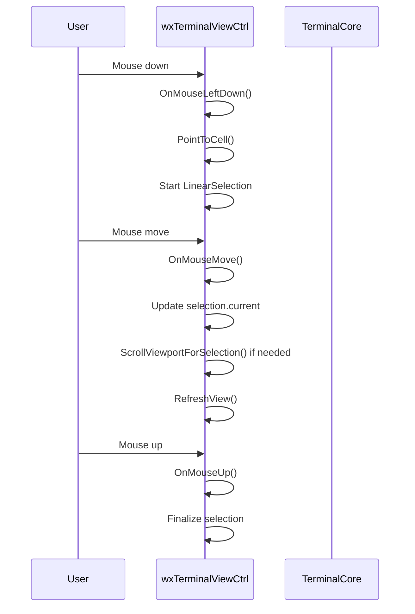

### Copy Workflow

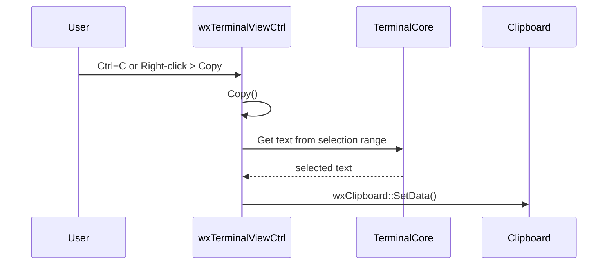

### Paste Workflow

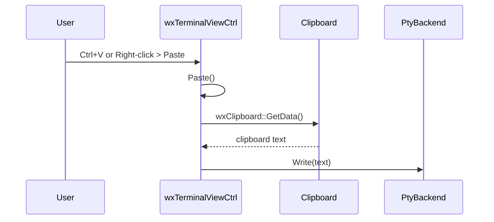

---

## 7. Process Lifecycle Workflow

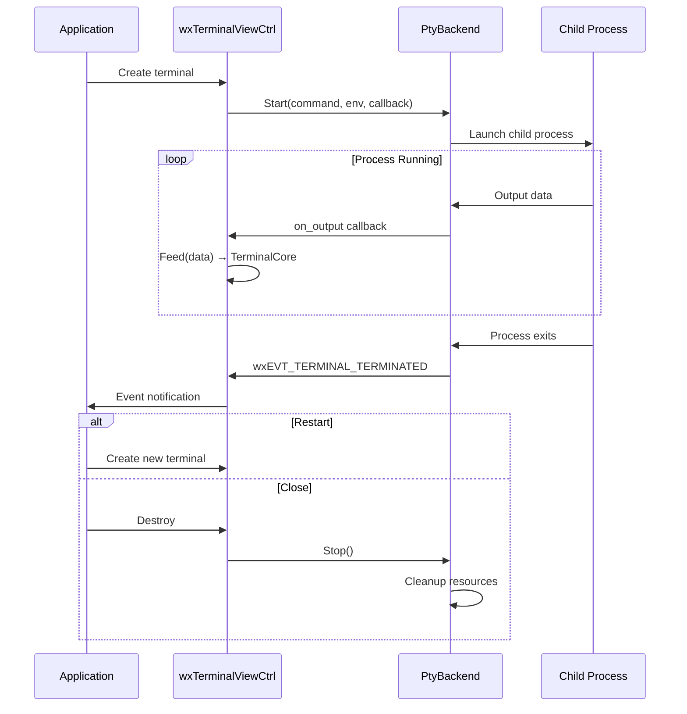

---

## 8. Theme Application Workflow

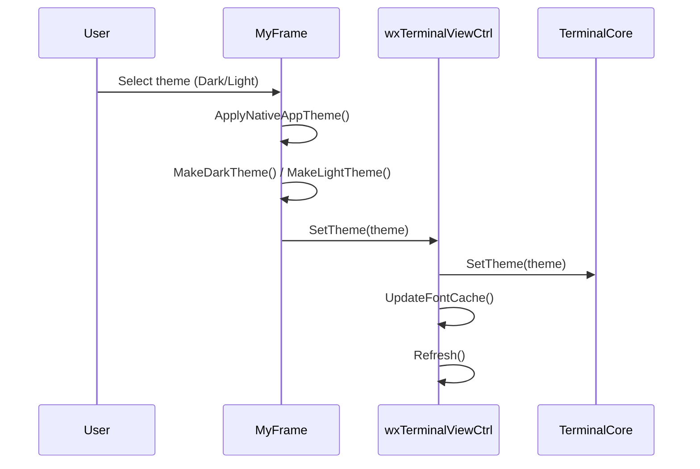
